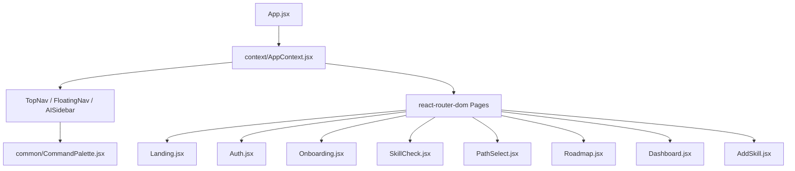

# WayPoint Front-End Analysis & Reference Guide

This document provides a detailed analysis of the **WayPoint** interactive client-side application. It maps out the design system, page flows, routing, component hierarchy, hooks, state management, and adaptive UI features. It is intended as a blueprint to preserve UI aesthetics and behavior when pulling updates or performing backend integrations.

---

## 🗺️ Application Architecture Overview

WayPoint is a React-based application built using **Vite**, **TailwindCSS (v4)**, and **shadcn/ui** design semantics. It manages interactive workflows (such as dynamic roadmaps and simulator panels) using several library integrations:



### Key Libraries & Frameworks
1. **Core:** React 18, Vite.
2. **Routing:** `react-router-dom` (v6) with declarative route guards and Framer Motion transitions.
3. **Styling:** TailwindCSS v4 `@import` syntax coupled with custom CSS variables for light/dark theme adaptation.
4. **Motion & Transitions:** `framer-motion` for page transitions, collapsible sections, slide-out sidebar, and step guides.
5. **Interactive Nodes / Map:** `reactflow` for the customized grid layout, handles, connector edges, and interactive node selection.
6. **Charts & Graphs:** `recharts` for the hexagonal skill-gap radar chart in the dashboard.
7. **Icons:** `lucide-react` for semantic vector representations.
8. **Toast Notifications:** `sonner` via UI wrapper for micro-feedback alerts.

---

## 📂 Codebase Directory & File Mapping

Below is the file breakdown of the `waypoint-app/src` directory:

| Path / File | Type | Purpose / Description |
| :--- | :--- | :--- |
| [`App.jsx`](file:///d:/HCL_WayPoint/waypoint-app/src/App.jsx) | Entry | Configures React Router, animation presence wrapper, route guarding, and global layouts (Sidebar, Palette, Toasters). |
| [`main.jsx`](file:///d:/HCL_WayPoint/waypoint-app/src/main.jsx) | Boot | Standard DOM rendering mount. |
| [`index.css`](file:///d:/HCL_WayPoint/waypoint-app/src/index.css) | Styles | The complete CSS Design System, mapping tokens, custom theme rules (Slate grey dark mode), animations, scrollbars, and React Flow theme integrations. |
| **`pages/`** | Views | Main screen route elements: |
| ├─ [`Landing.jsx`](file:///d:/HCL_WayPoint/waypoint-app/src/pages/Landing.jsx) | Page | Landing Page. Hero gauge, feature grid, collapsibles, testimonials, and marketing nav. |
| ├─ [`Auth.jsx`](file:///d:/HCL_WayPoint/waypoint-app/src/pages/Auth.jsx) | Page | Authentication Page. Two-pane layout with toggleable sign-up/login messaging and form inputs. |
| ├─ [`Onboarding.jsx`](file:///d:/HCL_WayPoint/waypoint-app/src/pages/Onboarding.jsx) | Page | Personalization form. Includes Web Speech API integration, time preset selectors, and learning style chips. |
| ├─ [`SkillCheck.jsx`](file:///d:/HCL_WayPoint/waypoint-app/src/pages/SkillCheck.jsx) | Page | Assessment Quiz. Scoring page with readiness outcome gauge, verified counts, and skill progress details. |
| ├─ [`PathSelect.jsx`](file:///d:/HCL_WayPoint/waypoint-app/src/pages/PathSelect.jsx) | Page | Career sub-paths selector showing shared basics vs unique path specializations. |
| ├─ [`Roadmap.jsx`](file:///d:/HCL_WayPoint/waypoint-app/src/pages/Roadmap.jsx) | Page | Interactive roadmap. Visualizes in "Flow view" (React Flow grid nodes) or "Tree view" (Collapsible branch accordions). |
| ├─ [`Dashboard.jsx`](file:///d:/HCL_WayPoint/waypoint-app/src/pages/Dashboard.jsx) | Page | Comprehensive learning progress layout, including radar charts, stats tiles, and what-if simulators. |
| └─ [`AddSkill.jsx`](file:///d:/HCL_WayPoint/waypoint-app/src/pages/AddSkill.jsx) | Page | Selector to search and register a new learning track. |
| **`components/common/`** | UI | Reusable domain-specific widgets: |
| ├─ [`ReadinessGauge.jsx`](file:///d:/HCL_WayPoint/waypoint-app/src/components/common/ReadinessGauge.jsx) | Widget | SVG circular gauge utilizing custom gradient stroke and count-up values. |
| ├─ [`CareerSimPanel.jsx`](file:///d:/HCL_WayPoint/waypoint-app/src/components/common/CareerSimPanel.jsx) | Widget | Dynamic career commitment simulator slider and horizon projection. |
| ├─ [`ActivityHeatmap.jsx`](file:///d:/HCL_WayPoint/waypoint-app/src/components/common/ActivityHeatmap.jsx) | Widget | 90-day learning calendar grid. |
| ├─ [`TrackSelector.jsx`](file:///d:/HCL_WayPoint/waypoint-app/src/components/common/TrackSelector.jsx) | Widget | Dropdown selector to switch between active and completed tracks in the header. |
| ├─ [`CommandPalette.jsx`](file:///d:/HCL_WayPoint/waypoint-app/src/components/common/CommandPalette.jsx) | Widget | Global search shortcut palette (`Cmd/Ctrl + K`). |
| ├─ [`SkillStatusCard.jsx`](file:///d:/HCL_WayPoint/waypoint-app/src/components/common/SkillStatusCard.jsx) | Widget | Card representing skill scores with progress bar. |
| ├─ [`MatchScoreBadge.jsx`](file:///d:/HCL_WayPoint/waypoint-app/src/components/common/MatchScoreBadge.jsx) | Widget | Displays node match ratings. |
| └─ [`UserMenu.jsx`](file:///d:/HCL_WayPoint/waypoint-app/src/components/common/UserMenu.jsx) | Widget | Avatar dropdown for profile details and log out. |
| **`components/layout/`** | Shell | Shared wrapper components: |
| ├─ [`FloatingNav.jsx`](file:///d:/HCL_WayPoint/waypoint-app/src/components/layout/FloatingNav.jsx) | Shell | Glassmorphic floating navigation capsule. |
| ├─ [`TopNav.jsx`](file:///d:/HCL_WayPoint/waypoint-app/src/components/layout/TopNav.jsx) | Shell | Sticky layout header housing the logo, tabs, search toggle, and account selector. |
| └─ [`AISidebar.jsx`](file:///d:/HCL_WayPoint/waypoint-app/src/components/layout/AISidebar.jsx) | Shell | AI Drawer side panel. Contains typewriter descriptions, Q&A suggestions, feedback logs, and match detail bars. |
| **`context/`** | State | State providers: |
| └─ [`AppContext.jsx`](file:///d:/HCL_WayPoint/waypoint-app/src/context/AppContext.jsx) | Provider | Manages theme, tracks data state, active track ID, user profile context, sidebar status, loading conditions, and optimistic node state updates. |
| **`services/`** | Networks | Service wrappers: |
| └─ [`api.js`](file:///d:/HCL_WayPoint/waypoint-app/src/services/api.js) | Network | Single-seam API layer routing between an offline `mock` delayed runner and a `real` fetch HTTP runner. |
| **`hooks/`** | Helpers | Custom React hooks: |
| ├─ [`useCountUp.js`](file:///d:/HCL_WayPoint/waypoint-app/src/hooks/useCountUp.js) | Helper | Smoothly increments numbers over a defined interval. |
| ├─ [`useScrolled.js`](file:///d:/HCL_WayPoint/waypoint-app/src/hooks/useScrolled.js) | Helper | Detects page scrolling position to add style borders. |
| └─ [`useTypewriter.js`](file:///d:/HCL_WayPoint/waypoint-app/src/hooks/useTypewriter.js) | Helper | Types text strings character-by-character for AI effect. |

---

## 🎨 Theme, Styling, & Visual Tokens

The styles in [`index.css`](file:///d:/HCL_WayPoint/waypoint-app/src/index.css) define a premium visual design language:

*   **Font System:** Sans typography uses `Inter`, while display titles use `Outfit`. Monospace text and scores render in `JetBrains Mono` with `tabular-nums` alignment (preventing layout shifts).
*   **Light Theme Canvas:** Uses a cool off-white (`#f5f6fb`) background, lifting white card components (`#ffffff`) above it.
*   **Premium Dark Theme:** Uses a cool slate ramp (`#1e2028`) instead of pitch black, and elevates cards with `#272a34`, border accents with `#3b4155`, and hover surfaces with `#363b4a`.
*   **Themed Scrollbars:** Webkit thumb styles map to `--border` variables and scale transitions smoothly.
*   **Glassmorphism:** Navigation menus use the `.glass` class:
    ```css
    .glass {
      background: color-mix(in srgb, var(--background) 72%, transparent);
      backdrop-filter: saturate(180%) blur(16px);
    }
    ```
*   **Background Glows:** In dark mode, radial glow points are rendered behind the content for depth:
    ```css
    .dark body {
      background:
        radial-gradient(ellipse 80% 50% at 50% -10%, rgba(129,140,248,0.08) 0%, transparent 60%),
        radial-gradient(ellipse 60% 40% at 100% 100%, rgba(45,212,191,0.05) 0%, transparent 50%),
        var(--background);
    }
    ```

---

## 🔄 Core User Flow & Routing

The routing path is configured in [`App.jsx`](file:///d:/HCL_WayPoint/waypoint-app/src/App.jsx):

```
[/] Landing Page -> [Log In / Get Started] -> [/auth] Login/Signup
                                                    │
                                                    ▼
[/onboarding] Onboarding Personalization Wizard (Basic profile, hours, goals)
                                                    │
                                                    ▼
[/skill-check] Verification Quiz -> [Submit] -> Readiness Score & Breakdown
                                                    │
                                                    ▼
[/path-select] Sub-path Selector (suggested career tracks)
                                                    │
                                                    ▼
[/roadmap] Interactive Roadmap (Flow / Tree views) <───> [/dashboard] Main Stats Hub
                                                                ▲
                                                                │
                                                                ▼
                                                        [/add-skill] Add new Track
```

### Route Guarding (`RequireAuth`)
Auth is enforced on pages like `/onboarding`, `/skill-check`, `/path-select`, `/roadmap`, `/dashboard`, and `/add-skill` via `RequireAuth`.
*   **Enforced:** Only when VITE_USE_MOCK is set to `false`.
*   **Bypassed:** In mock mode (`USE_MOCK = true`), the guard acts as a pass-through so developers and demo users can traverse pages without auth requirements.

---

## 🛠️ Key UI Screens & Interactive Features

### 1. Interactive Roadmap (`Roadmap.jsx`)
Features two presentation modes:
*   **Flow View:** Powered by `reactflow`. Renders custom nodes (`wp` type) mapped across predefined coordinates (`LAYOUT`).
    *   **Node positions:** `f1` to `m3` are sequenced in a snaking path:
        ```javascript
        const LAYOUT = {
          f1: { col: 0, row: 0, in: null, out: Position.Right },
          f2: { col: 1, row: 0, in: Position.Left, out: Position.Right },
          f3: { col: 2, row: 0, in: Position.Left, out: Position.Bottom },
          d1: { col: 2, row: 1, in: Position.Top, out: Position.Left },
          d2: { col: 1, row: 1, in: Position.Right, out: Position.Left },
          m1: { col: 0, row: 1, in: Position.Right, out: Position.Bottom },
          m2: { col: 0, row: 2, in: Position.Top, out: Position.Right },
          m3: { col: 1, row: 2, in: Position.Left, out: null },
        };
        ```
    *   **Node Details:** Displays completion status (with custom icons), match scores, duration, and developmental stage. Handles are styled invisibly so lines connect to card borders.
    *   **Interactive Edges:** Edge connectors animate when a prerequisite node is marked `in_progress`, and change to solid teal (`#0ea5a4`) when `completed`.
*   **Tree View:** Renders branch cards horizontally (Foundations, Core Build, Advanced) with accordion click-handlers. Shows completion statistics and progress indicators for each stage.

### 2. Readiness Gauge (`ReadinessGauge.jsx`)
An animated circular gauge using SVG:
*   Computes circular stroke offsets dynamically:
    ```javascript
    const radius = (size - strokeWidth) / 2;
    const circumference = 2 * Math.PI * radius;
    const offset = circumference * (1 - animatedValue / 100);
    ```
*   Integrates a count-up transition hook (`useCountUp.js`) to smoothly animate values from zero to the computed score when the page loads.

### 3. Career Simulator (`CareerSimPanel.jsx`)
A slider widget that calculates estimated preparation timelines:
*   **Inputs:** Weekly time commitment slider (2h to 20h) and target role.
*   **Logic:** Re-calculates estimated weeks to goal based on remaining content weeks and baseline ratios:
    ```javascript
    estimatedWeeks = remainingContentWeeks * (baseline / weeklyHours)
    ```
*   **Projections:** Recalculates projected readiness percentages over an 8-week horizon window.

### 4. Personalization Wizard (`Onboarding.jsx`)
Collects basic user profile details and includes **Speech-to-Text Input**:
*   Uses a `useSpeechInput` hook integrated with the browser's Web Speech API (`webkitSpeechRecognition`).
*   Provides voice recording capability for the "Experience" textarea in supported browsers.

### 5. Progress Dashboard (`Dashboard.jsx`)
The central hub for user statistics and performance insights:
*   **Hero Unit:** Features a large circular Readiness Gauge alongside verified skill counts and gap indicators.
*   **Stat Tiles:** Display flame streak icons, XP tallies, completion percentages, and estimated preparation time.
*   **Radar Chart Toggle:** Toggles between a hexagonal `recharts` radar chart and a ranked `SkillGapBars` progress chart.
*   **Milestone Timeline:** Renders connecting steps that update dynamically based on node completion.
*   **Activity Heatmap:** Renders a 90-day grid representing simulated daily commit logs.

---

## 🎛️ State Management & Network Seams

### AppContext State (`AppContext.jsx`)
Houses central states to ensure consistent synchronization across pages:
*   **Theme State:** Updates the Document Object Model root element (`document.documentElement.classList.toggle('dark')`) and persists values to local storage.
*   **Tracks:** Main container for learning tracks (`ml`, `java`, `mern`, etc.) pulled from database endpoints.
*   **Selected Node Context:** Tracks the selected node ID and toggles the AI Sidebar.
*   **Optimistic UI Updates:** Updates node completion states locally before network requests resolve to ensure a responsive UI:
    ```javascript
    const updateNodeStatus = useCallback((trackId, nodeId, newStatus) => {
      setTracks(prev => { ... /* Optimistically update state */ });
      api.updateNodeStatus(trackId, nodeId, newStatus).catch(...);
    }, []);
    ```

### Network Client Wrapper (`api.js`)
Serves as the gateway between the UI and server databases:
*   Uses `VITE_USE_MOCK` to switch between offline and online API calls.
*   **Mock Endpoint Handler:** Emulates database lookups and query latencies using `setTimeout` promises.
*   **Real Endpoint Client:** Standardized fetch wrapper that appends bearer tokens to headers and maps data to contract definitions.

---

## ⚠️ Important Preservation Checklist

When working on backend integrations, check that:
1. **Mock Fallback Stays Safe:** The `USE_MOCK` toggle remains functional so the application can run offline during testing.
2. **React Flow Layout Coordinate Safety:** Coordinate positions (`col` * `COL_W` and `row` * `ROW_H`) in [`Roadmap.jsx`](file:///d:/HCL_WayPoint/waypoint-app/src/pages/Roadmap.jsx) are preserved so nodes align correctly on the canvas.
3. **Scrollbar and Typography Standards:** Scrollbar styling declarations in `index.css` remain unchanged to maintain dark mode aesthetic consistency.
4. **Auth Guards Enforcements:** `AUTH_ENFORCED` stays synchronized with `!USE_MOCK` so login flows do not block offline mock execution.
5. **No Placeholders:** Ensure custom SVG visuals, gauge arcs, heatmaps, and sliders continue to use dynamic local calculations instead of static mockup text.
